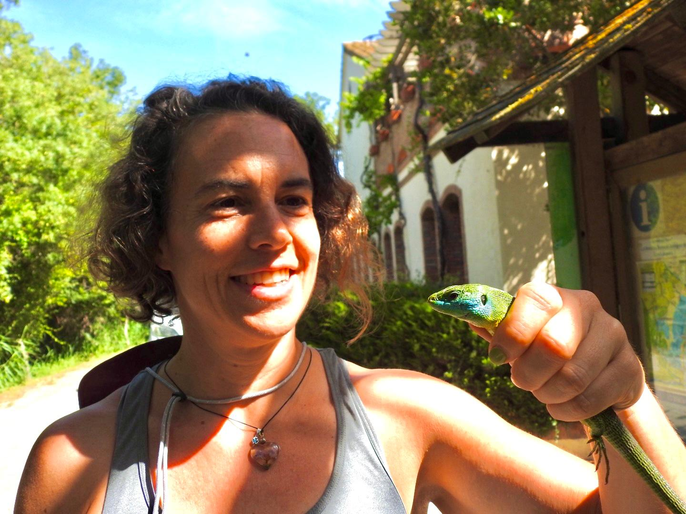
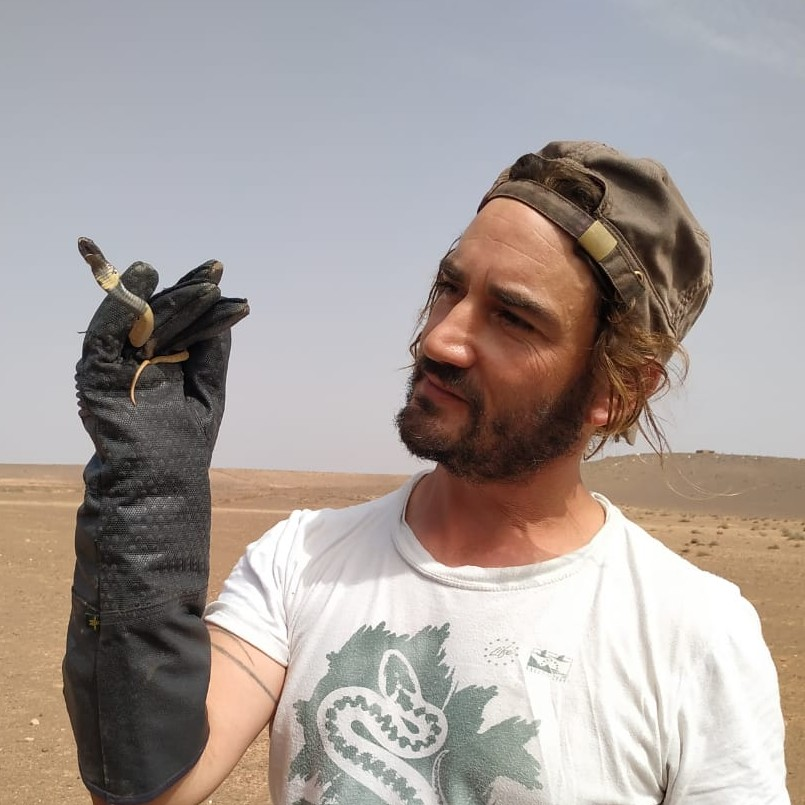
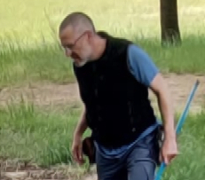
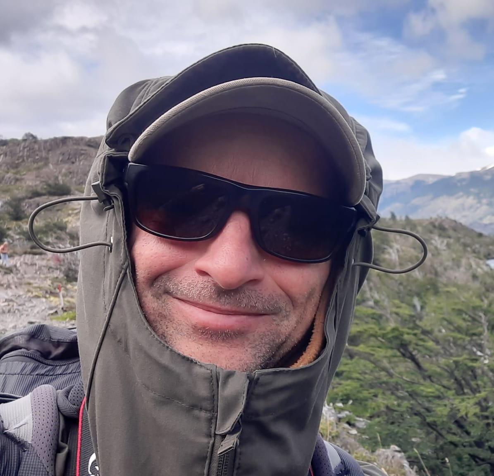

  

    
    

      <h3 class="text-xl font-bold mb-1">Antigoni Kaliontzopoulou</h3>
      
Antigoni is an evolutionary ecologist interested in the evolution of phenotypic diversity. She uses reptiles and amphibians as model organisms, and combines tools like geometric morphometrics, multivariate statistics, and phylogenetic comparative methods to provide a better understanding of the links between morphology, ecology, and selection, and decipher the evolutionary meaning of diversity at the micro- and macro-evolutionary scale.

      

        <a href="https://sites.google.com/view/akaliontzopoulou/" target="_blank" class="text-primary-500 hover:underline">Website</a>
      

    

  

  

    
    

      <h3 class="text-xl font-bold mb-1">Fernando Martínez-Freiría</h3>
      
Fernando investigates the complex interactions between phenotypic and genetic diversity to inform biodiversity conservation under anthropogenic change. By utilizing ectotherms —specifically venomous snakes— as model organisms, his research integrates extensive fieldwork and museum data with advanced tools in phylogeography, population genetics, and venomics. His multidisciplinary approach employs multivariate statistics, GIS, and ecological modelling to spatially analyze how evolutionary and ecological forces shape morphological and environmental variation.

      

        <a href="https://investigacion.usc.gal/investigadores/2192329/detalle" target="_blank" class="text-primary-500 hover:underline">Website</a>
      

    

  

  

    
    

      <h3 class="text-xl font-bold mb-1">Neftalí Sillero</h3>
      
Neftalí is a spatial biologist focused on monitoring global biodiversity and ecosystem health through the integration of Earth Observation, GIS, and Remote Sensing. His research spans spatial ecology, biogeography, and the development of distribution atlases, utilizing ecological niche modelling and spatial statistics to inform conservation strategies. While primarily using amphibians and reptiles as model organisms, he also applies his spatial expertise to a diverse range of other flora and fauna groups.

      

        <a href="https://sites.google.com/site/neftalisillero/" target="_blank" class="text-primary-500 hover:underline">Website</a>
      

    

  

  

    
    

      <h3 class="text-xl font-bold mb-1">Carolina Reyes-Puig</h3>
      
Carolina serves as a Professor and Researcher at Universidad San Francisco de Quito (USFQ), where she also oversees the Vertebrate Section of the Zoology Museum as Curator. A leading expert in Neotropical biodiversity, her professional work focuses on the conservation and taxonomy of small vertebrates, as well as large mammal monitoring using camera trap technology. Beyond the classroom, she contributes to global conservation efforts by identifying priority areas for species protection and advancing our understanding of ectotherm evolution.

      

        <a href="https://www.usfq.edu.ec/en/profiles/carolina-reyes-puig" target="_blank" class="text-primary-500 hover:underline">Website</a>
      

    

  

  

    
    

      <h3 class="text-xl font-bold mb-1">Anamarija Žagar</h3>
      
Anamarija specializes in animal ecology, physiology, and behavior, with a particular focus on the metabolic and physiological constraints of ectotherms. Her work utilizes climate chambers and natural environmental gradients to investigate how lizards adapt to climate change. Recently she gained interest in exploring the structural properties of skin in relation to water retention and plasticity.

      

        <a href="https://www.nib.si/eng/index.php/component/directory/?view=details&id=265&Itemid=12" target="_blank" class="text-primary-500 hover:underline">Website</a>
      

    

  

  

    
    

      <h3 class="text-xl font-bold mb-1">Urban Dajčman</h3>
      
Urban is a Research Assistant at the Department of Organisms and Ecosystems Research (National Institute of Biology, Liubljana, Slovenia), focusing on the coexistence mechanisms of lizard species under the pressures of climate change and habitat loss. His work integrates extensive fieldwork with advanced laboratory techniques, such as DNA metabarcoding, to analyze lizard diets and the impact of unicellular parasites. For his doctoral research, he employs R and Matlab to combine mechanistic and correlative ecological models, specifically utilizing Dynamic Energy Budget theory to understand species distribution. Additionally, Dr. Dajčman contributes to various international projects investigating physiological adaptations and population genetics across several species of reptiles and amphibians.

      

        <a href="https://studentwebsite.com" target="_blank" class="text-primary-500 hover:underline">Website</a>
      

    

  

  

    
    

      <h3 class="text-xl font-bold mb-1">Zbyszek Boratyński</h3>
      
Zbyszek is an evolutionary ecologist and eco-physiologist. He pursues hypothesis driven research, identifying suitable systems for the specific question. He works primarily on small vertebrates (rodents, lizards) but does also engage research on diverse organisms. His research, pursued within international network of colleagues, is motivated by processes shaping biological diversity, <i>is situ</i> experimentation, extreme environmental events and environmental change.

      

        <a href="https://boratyns.wixsite.com/boratynski" target="_blank" class="text-primary-500 hover:underline">Website</a>
      

    

  

