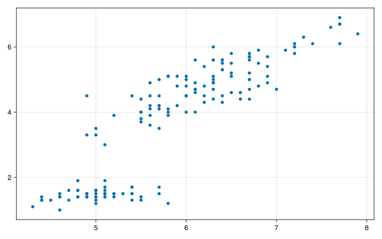
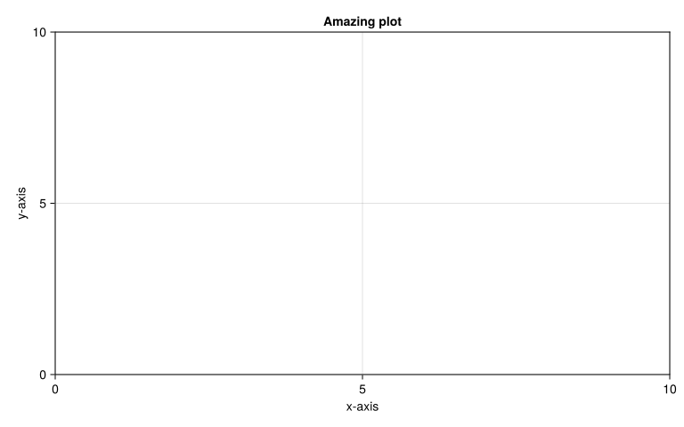
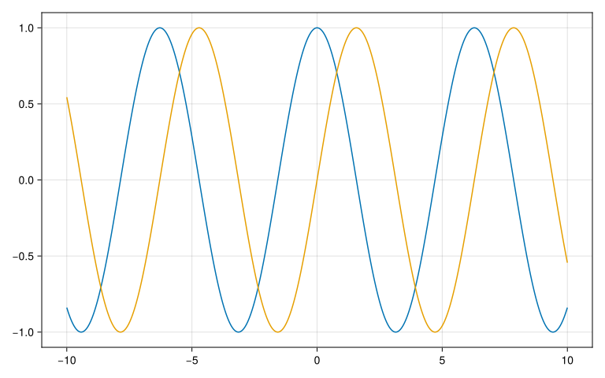
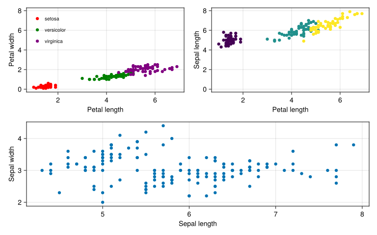
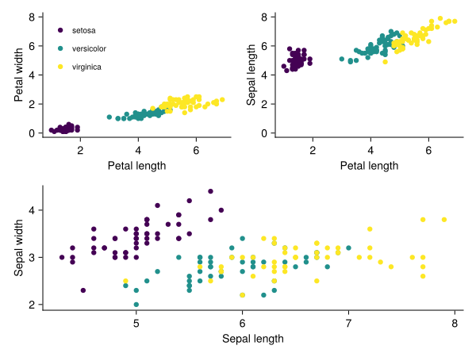

``` julia
using CairoMakie
using RDatasets
using DataFramesMeta: @with
using CategoricalArrays: levelcode

iris = dataset("datasets", "iris")
typeof(iris)

scatter(iris.SepalLength, iris.PetalLength)
```

<pre><span class="ansi-yellow-fg ansi-bold">┌ </span><span class="ansi-yellow-fg ansi-bold">Warning: </span>Found `resolution` in the theme when creating a `Scene`. The `resolution` keyword for `Scene`s and `Figure`s has been deprecated. Use `Figure(; size = ...` or `Scene(; size = ...)` instead, which better reflects that this is a unitless size and not a pixel resolution. The key could also come from `set_theme!` calls or related theming functions.

<span class="ansi-yellow-fg ansi-bold">└ </span><span class="ansi-bright-black-fg">@ Makie ~/.julia/packages/Makie/kJl0u/src/scenes.jl:264</span>
</pre>



``` julia
# basic structure of Makie
f = Figure();

ax = Axis(f[1, 1],
    xlabel="x-axis",
    ylabel="y-axis",
    title="Amazing plot")
f
```

<pre><span class="ansi-yellow-fg ansi-bold">┌ </span><span class="ansi-yellow-fg ansi-bold">Warning: </span>Found `resolution` in the theme when creating a `Scene`. The `resolution` keyword for `Scene`s and `Figure`s has been deprecated. Use `Figure(; size = ...` or `Scene(; size = ...)` instead, which better reflects that this is a unitless size and not a pixel resolution. The key could also come from `set_theme!` calls or related theming functions.

<span class="ansi-yellow-fg ansi-bold">└ </span><span class="ansi-bright-black-fg">@ Makie ~/.julia/packages/Makie/kJl0u/src/scenes.jl:264</span>
</pre>



``` julia
# plotting with lines
x = LinRange(-10, 10, 1000)
y = cos.(x)
obj = lines(x, y)
```

<pre><span class="ansi-yellow-fg ansi-bold">┌ </span><span class="ansi-yellow-fg ansi-bold">Warning: </span>Found `resolution` in the theme when creating a `Scene`. The `resolution` keyword for `Scene`s and `Figure`s has been deprecated. Use `Figure(; size = ...` or `Scene(; size = ...)` instead, which better reflects that this is a unitless size and not a pixel resolution. The key could also come from `set_theme!` calls or related theming functions.

<span class="ansi-yellow-fg ansi-bold">└ </span><span class="ansi-bright-black-fg">@ Makie ~/.julia/packages/Makie/kJl0u/src/scenes.jl:264</span>
</pre>


``` julia
typeof(obj)
```

    Makie.FigureAxisPlot

``` julia
# plotting in the same panel
fig, axs, plot = lines(x, y)
lines!(axs, x, sin.(x))
fig
```

<pre><span class="ansi-yellow-fg ansi-bold">┌ </span><span class="ansi-yellow-fg ansi-bold">Warning: </span>Found `resolution` in the theme when creating a `Scene`. The `resolution` keyword for `Scene`s and `Figure`s has been deprecated. Use `Figure(; size = ...` or `Scene(; size = ...)` instead, which better reflects that this is a unitless size and not a pixel resolution. The key could also come from `set_theme!` calls or related theming functions.

<span class="ansi-yellow-fg ansi-bold">└ </span><span class="ansi-bright-black-fg">@ Makie ~/.julia/packages/Makie/kJl0u/src/scenes.jl:264</span>
</pre>



``` julia
# making additional pannels (axes)
fig, ax1, plot = lines(x, sin)
ax2 = Axis(fig[2, 1])
lines!(ax2, x, cos, color=:tomato)
fig
```

<pre><span class="ansi-yellow-fg ansi-bold">┌ </span><span class="ansi-yellow-fg ansi-bold">Warning: </span>Found `resolution` in the theme when creating a `Scene`. The `resolution` keyword for `Scene`s and `Figure`s has been deprecated. Use `Figure(; size = ...` or `Scene(; size = ...)` instead, which better reflects that this is a unitless size and not a pixel resolution. The key could also come from `set_theme!` calls or related theming functions.

<span class="ansi-yellow-fg ansi-bold">└ </span><span class="ansi-bright-black-fg">@ Makie ~/.julia/packages/Makie/kJl0u/src/scenes.jl:264</span>
</pre>


``` julia
# trying with iris dataset
fig_iris = Figure();
ax_iris = Axis(fig_iris[1, 1],
    xlabel="Petal length",
    ylabel="Petal width")

colors_sp = [:red, :green, :purple]

for (i, sp) in enumerate(unique(iris.Species))
    index = findall(==(sp), iris.Species)
    scatter!(ax_iris, iris.PetalLength[index], iris.PetalWidth[index],
        color=colors_sp[i],
        label=string(sp))
end
axislegend(framevisible=false, position=:lt, labelsize=10)
```

<pre><span class="ansi-yellow-fg ansi-bold">┌ </span><span class="ansi-yellow-fg ansi-bold">Warning: </span>Found `resolution` in the theme when creating a `Scene`. The `resolution` keyword for `Scene`s and `Figure`s has been deprecated. Use `Figure(; size = ...` or `Scene(; size = ...)` instead, which better reflects that this is a unitless size and not a pixel resolution. The key could also come from `set_theme!` calls or related theming functions.

<span class="ansi-yellow-fg ansi-bold">└ </span><span class="ansi-bright-black-fg">@ Makie ~/.julia/packages/Makie/kJl0u/src/scenes.jl:264</span>
</pre>

    Legend()

``` julia
ax2_iris = Axis(fig_iris[1, 2],
    xlabel="Petal length",
    ylabel="Sepal length")
scatter!(ax2_iris, iris.PetalLength, iris.SepalLength,
    color=levelcode.(iris.Species))

linkyaxes!(ax_iris, ax2_iris)

ax3_iris = Axis(fig_iris[2, :],
    xlabel="Sepal length",
    ylabel="Sepal width")
scatter!(ax3_iris, iris.SepalLength, iris.SepalWidth)

fig_iris
```



``` julia
using ColorSchemes
import ColorSchemes.viridis

colors_sp = [viridis[0.0], viridis[0.5], viridis[1.0]]

my_theme = Theme(
    Axis = (
        topspinevisible = false,
        rightspinevisible = false,
        ygridvisible = false,
        xgridvisible = false,
    )
)

@with iris begin
    with_theme(my_theme) do
        fig_iris = Figure()

        ax_iris = Axis(fig_iris[1, 1],
            xlabel="Petal length",
            ylabel="Petal width")
        for (i, sp) in enumerate(unique(:Species))
            index = findall(==(sp), :Species)
            scatter!(ax_iris, :PetalLength[index], :PetalWidth[index],
                color=colors_sp[i],
                label=string(sp))

        end
        axislegend(framevisible=false, position=Symbol("lt"), labelsize=10)

        ax2_iris = Axis(fig_iris[1, 2],
            xlabel="Petal length",
            ylabel="Sepal length")
        for (i, sp) in enumerate(unique(:Species))
            index = findall(==(sp), :Species)
            scatter!(ax2_iris, :PetalLength[index], :SepalLength[index],
                color=colors_sp[i],
                label=string(sp))
        end
        linkyaxes!(ax_iris, ax2_iris)

        ax3_iris = Axis(fig_iris[2, :],
            xlabel="Sepal length",
            ylabel="Sepal width")
        for (i, sp) in enumerate(unique(:Species))
            index = findall(==(sp), :Species)
            scatter!(ax3_iris, :SepalLength[index], :SepalWidth[index],
                color=colors_sp[i],
                label=string(sp))
        end
        
        fig_iris
    end
end
```


