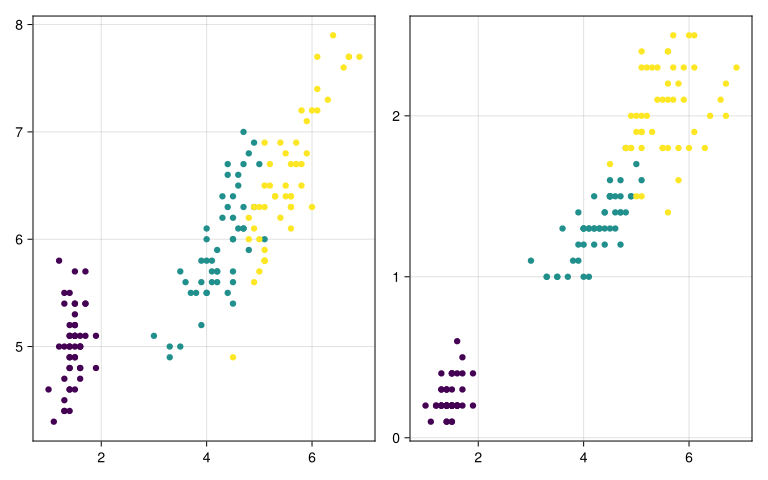
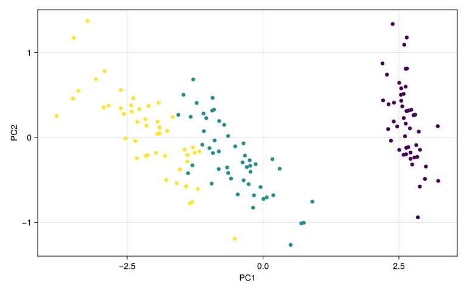
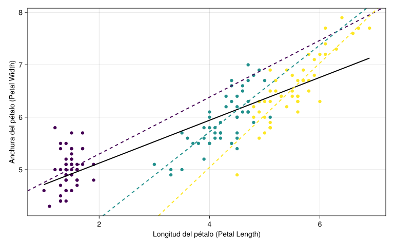

<script src="https://cdn.jsdelivr.net/npm/requirejs@2.3.6/require.min.js" integrity="sha384-c9c+LnTbwQ3aujuU7ULEPVvgLs+Fn6fJUvIGTsuu1ZcCf11fiEubah0ttpca4ntM sha384-6V1/AdqZRWk1KAlWbKBlGhN7VG4iE/yAZcO6NZPMF8od0vukrvr0tg4qY6NSrItx" crossorigin="anonymous"></script>
<script src="https://cdn.jsdelivr.net/npm/jquery@3.5.1/dist/jquery.min.js" integrity="sha384-ZvpUoO/+PpLXR1lu4jmpXWu80pZlYUAfxl5NsBMWOEPSjUn/6Z/hRTt8+pR6L4N2" crossorigin="anonymous" data-relocate-top="true"></script>
<script type="application/javascript">define('jquery', [],function() {return window.jQuery;})</script>


## Importación de datos

En este primer ejemplo, importaremos los datos de Iris que descargué para otro curso (un curso de *git*). Para ello solo necesitamos hacer lo siguiente:

``` julia
using DataFrames, DataFramesMeta
using RDatasets
using CategoricalArrays

iris = dataset("datasets", "iris")
#=iris[!, :Species] = categorical(iris[!, :Species])=#
first(iris, 5)
```

<div><div style = "float: left;"><span>5×5 DataFrame</span></div><div style = "clear: both;"></div></div><div class = "data-frame" style = "overflow-x: scroll;">

| Row | SepalLength | SepalWidth | PetalLength | PetalWidth | Species |
|----:|------------:|-----------:|------------:|-----------:|:--------|
|     |     Float64 |    Float64 |     Float64 |    Float64 | Cat...  |
|   1 |         5.1 |        3.5 |         1.4 |        0.2 | setosa  |
|   2 |         4.9 |        3.0 |         1.4 |        0.2 | setosa  |
|   3 |         4.7 |        3.2 |         1.3 |        0.2 | setosa  |
|   4 |         4.6 |        3.1 |         1.5 |        0.2 | setosa  |
|   5 |         5.0 |        3.6 |         1.4 |        0.2 | setosa  |

</div>

## Gráficos básicos

Un simple diagrama de caja (boxplot) que muestra la longitud del sépalo por especie:

``` julia
using StatsPlots: boxplot
boxplot(iris.Species, iris.SepalLength)
```

<img src="data:image/png;base64,iVBORw0KGgoAAAANSUhEUgAAAlgAAAGQCAIAAAD9V4nPAAAABmJLR0QA/wD/AP+gvaeTAAAgAElEQVR4nO3de1zUdf7o8c/MwMwwgEigoCIqpKSmULjiJc0VFQlNTS21XO3RxV+ta51s19zctMz12prpnkrL26k2o8RbYorpqkUKKireAkRI84YgMoAzMPM9f8xZHhzXdFBmvgyf1/OvmfE783nPMPJi5jsXjaIoAgAAWWnVHgAAADURQgCA1AghAEBqhBAAIDVCCACQGiEEAEiNEAIApOZsCHNzc0eMGBEZGRkTE7NkyRKXzgQAgNt4ObndmDFj+vTps3r16jNnziQkJERGRg4ZMsSlkwEA4AbOPiI8ceLE+PHjAwICHnrooZ49ex4/ftylYwEA4B7OhnDixIkLFiw4duxYSkpKVlbW8OHDf2vLBQsWXLx4sZ7GawwURbHZbGpPAQ9js9nsdrvaU8DDVFdXqz2CR9I4+VmjWVlZo0ePNhqNly9fHj9+/Pz583U63S23bNasmcViqfnXqKiotLS0epvXA9lsNqvV6uPjo/Yg8CQWi0Wr1Xp7e6s9CDxJeXm5yWTSaDRqD9KAGI1GL6877AR0KoTl5eVt27ZdvXp1UlLSjRs3Bg0alJSUNG3atFtu3L1797///e+xsbGOowaDwWQy1XX0xoQQ4i4QQtwFs9ns6+tLCOvKqRfLnD17tri4OCEhQQhhNBrj4+MzMzN/a2OtVuvv7x8YGFhvMwIA4DJO7SNs166dv7//Z599JoQoKSnZtGlTTEyMiwcDAMAdnAqhyWRat27dggULQkND27dvHx0dPXXqVFdPBgCAGzj7PsKEhIQTJ05UVVWx0wIA0JjU7SPWqCAAoJHhs0YBAFIjhAAAqTm7jxAAUCfHjh379F/r3bmi1WrV6/XuXLGpr3HmX//i6e9cJIQA4BJarbZFgNGdK674fHPfbl2joqLctqLR6NYr6CINJYSVlZXPP/98VVWV2oPUG6PRuHLlyjt+tA+Axqpz586dO3d254o7fsgYOXJkUlKSOxdtBBrKr+mSkpLU1NSPP/5Y7UHqzYQJE/75z3/6+/urPQgA4HYaSgiFED4+PqNHj1Z7inrz3HPPqT0CAODOeNUoAEBqhBAAIDVCCACQGiEEAEiNEAIApNaAXjX633r07X/sSJbbltNotUv/sfDZZ59124oAANU16BDmncmveHWHCGrtnuU0W+efO3fOyY2PHj2anp6en58/fPjwHj16uHQwAIDrNOgQCiGEKUCYAt20lreP89v+7W9/8/Hx+emnn8LDwwkhAHiuBh9CtW3btq1169Y1n5O0ffv2Fi1adOnSZePGjUKI+Ph4VacDANwrXixzB/n5+W+88Ybj8I0bN8aOHavVcqMBQOPB7/Q7GD9+/L59+woKCoQQycnJ7v8UXQCASxHCO/Dz8xszZsyqVauEEMuXL580aZLaEwEA6hMhvLPJkyevXLkyOzv75MmTI0eOVHscAEB9IoR31rlz5/Dw8KeffnrChAmN41soAQA1CKFTXnrppaNHj9b+ZqVXX301MjIyPT195syZkZGR27ZtU3E8AMBda9Bvn9AI4f3dQo0pwD3L2X7ep4l77Jb/dOPGjX79+nXq1KnmlDlz5sycObPmqK+vr8vnAwC4QIMO4bJ/zM/Pz3fbctpHRwwbNuymE0tKStavXz9r1qxPP/209um+vr7EDwAagQYdwieffFLtEURFRUVOTs4HH3wwaNAgtWcBANS/Bh3ChqBVq1bz5s1TewoAgKvwYhkAgNQIIQBAaoQQACA1QggAkFpDebGMTqe7cuVKt27d1B6k3lRUVOh0OrWnAADcQUMJYUhISGZmZlVVldqD1Buj0WgymdSeAgBwBw0lhEKIrl27qj0CAEA67CMEAEiNEAIApEYIAQBSI4QAAKkRQgCA1AghAEBqhBAAIDVCCACQGiEEAEiNEAIApEYIAQBSI4QAAKkRQgCA1AghAEBqhBAAIDVCCACQGiEEAEiNEAIApEYIAQBSI4QAAKkRQgCA1AghAEBqhBAAIDVCCACQGiEEAEiNEAIApEYIAQBSI4QAAKkRQgCA1AghAEBqhBAAIDVCCACQGiEEAEiNEAIApEYIAQBSI4QAAKkRQgCA1AghAEBqhBAAIDVCCACQGiEEAEiNEAIApEYIAQBSI4QAAKkRQgCA1AghAEBqhBAAIDVCCACQGiEEAEiNEAIApObl5HaffPLJ1atXa45GRESMHj3aNSMBAOA+zj4ivH79esl/LFmy5ODBgy4dCwAA93D2EeFrr73mOHDp0qXFixdPnDjRVRMBAOBGdd5HuHbt2ri4uAceeMAV0wAA4GbOPiKssWrVqr/85S+32eDChQtvvPHGfffd5zjapk2bd9999y6naxRsNpvValUURe1BcPfy8vJmzFmguPHFZdV2u1YIrdZ9K3prxT/mvtOsWTO3rYh6Z7PZLBZLRUWF2oM0IHq93svrDqWrWwh/+OGHX375ZdSoUbfZpkmTJgMGDLj//vsdR4OCggwGQ51WaWRsNptGo5H8RvB0YWFh40YMceeKn/7rm2a+3o8/7r5FNRpNs2bNuKN6NK1W6+3tzQ+xNmf+mqxbCFeuXDl27Fg/P7/bbOPr6ztgwIC4uLg6XXLjptPpdDqd2lPg7gUGBj711FPuXHFP5tHw4CZuXhSeTqPRaLVaftvUVR1CaDabk5OTt2/f7rppAABwszrsgVi3bl2rVq169OjhumkAAHCzOjwiHDBgwIABA1w3CgAA7leHELZp08Z1cwAAoAo+axQAIDVCCACQWp3fUA8Anshmsx05cqRxf7RFaWlpbm5u4/4s6ODg4HrfT0cIAUghPT29/+hnjc3C1B7EhaylV9/88EvtpxvUHsRV7JbKED993sE99XuxhBCAFGw2m6lVh9L/abSRcLCoPYBrnT9uXf9yvV8q+wgBAFIjhAAAqRFCAIDUCCEAQGqEEAAgNUIIAJAaIQQASI0QAgCkRggBAFIjhAAAqRFCAIDUCCEAQGqEEAAgNUIIAJAaIQQASI0QAgCkRggBAFIjhAAAqRFCAIDUCCEAQGqEEAAgNUIIAJAaIQQASI0QAgCkRggBAFIjhAAAqRFCAIDUCCEAQGqEEAAgNUIIAJAaIQQASI0QAgCkRggBAFIjhAAAqRFCAIDUvNQeAADcoaysrLzsukh9T+1BcA8qSsqrlHq/VEIIQBol58TPu9UeAvfAYtZWl9X7pRJCAFLw9/f3De9U+j8b1B4E9+D8cZ/1L9f7pbKPEAAgNUIIAJAaIQQASI0QAgCkRggBAFIjhAAAqRFCAIDUCCEAQGqEEAAgNUIIAJAaIQQASI0QAgCkRggBAFIjhAAAqRFCAIDUCCEAQGp8MS88j9VqfXrSlGvlFrUHcaFTeflGYUs7eErtQVyodUjQyqWL1J4CIITwQKWlpZu2bLWOXKD2IK7kfVlovXN9A9Wew2UUu3b1FEKIhoAQwiNpvQ2i20i1p8A9sNvEF1PUHgIQgn2EAADJEUIAgNQIIQBAaoQQACA1XiwDQBY3rv5q+Pp1tadwIZvdrtVoNBqN2oO4imK+ptHWf7YIIQApPPzww0v/+rKiKGoP4kKLP141oFe3Ll0eVHsQF2rTZly9XyYhBCAFf3//F154Qe0pXOurLdsHDx6clJSk9iAehn2EAACpEUIAgNQIIQBAaoQQACA1QggAkBohBABIjRACAKRGCAEAUiOEAACpEUIAgNQIIQBAaoQQACA1QggAkBohBABIrQ5fw2S32zMyMi5cuNC+ffvOnTu7biYAANzG2RAWFRUlJSWVlZVFRUWdPHly48aNUVFRLp0MAAA3cDaEkydPjoqKWr16tVarFULY7XZXTgUAgJs4FcLy8vJvvvnm1KlTP//8s06ni4yMdOQQAABP51QIz549q9VqJ0+ebLFYfv3119DQ0C1btvj5+d1yY7PZnJaWdvbsWcfR++67r3///vU1riey/YfagzQe3JiNBj/K+qUoit1u51atTavVajSa22/jVAjNZrPVah04cOBrr71WXV396KOPLl26dPr06bfcuKysLC0t7dChQ46jbdq06d27d53mbmRsNpvVauUxdD2yWq2KUNSeAvdKEcJisag9RaNit9urqqq4VWvT6/VeXnconVMhbNGihRAiMTFRCOHl5TVw4MCazt1y43nz5sXFxdVl1MbMZrN5eXn5+PioPUjj4ePjoxF3+BMPDZ9GCJPJpPYUjYpOpzMYDNyqdeXUw5SwsLCIiIjCwkLH0cLCwtDQUFdOBQCAmzj1iFCr1U6fPn3y5MkzZsw4d+5cSkpKenq6qycDAMANnH37xPPPP9+iRYvU1NTAwMDMzMzIyEiXjgUAgHvU4ZNlkpKSkpKSXDcKAADux0sZAQBSI4QAAKkRQgCA1OqwjxBoIKqqqm7YNOKtaLUHwT1RfALVHgEQghDCE3l7exs0NsuULWoPgntgt2vmPqL2EIAQhBAeSqPViuB2ak+Be2Dn8zDRULCPEAAgNUIIAJAaIQQASI0QAgCkRggBAFIjhAAAqUn39onKysp3Fy4uv1HlthUVRXF8N6/bVtRpNZOfG9+uHe8uAIA7ky6EGo0m0KRvYtC5bcUDBw6cuVg85vHBbltRCKHR8AXuAOAU6UJoNBpff/11d664YsWK3Qeypk2b5s5FAQBOYh8hAEBqhBAAIDVCCACQGiEEAEiNEAIApEYIAQBSI4QAAKkRQgCA1AghAEBqhBAAIDVCCACQGiEEAEiNEAIApEYIAQBSI4QAAKkRQgCA1KT7Yl40AhqNptpq8f0/L6g9iAtV2+0aReh0jfhPVaXSy6D2DK61d+/e9z5c6c4Vj/6c/+4//rni86/dtmJTX+OnHy3T6XRuW9EVCCE8T3Bw8Dcrl1ksFrUHcaFPvvi6ma/3sGFD1R7EhZo0Gaf2CK4VERHx9IjH3LniyMT+BoNBo9G4bUWj0ejpFRSEEB7q8ccfV3sE19p9ICs8uMno0aPVHgR3r1WrVm7+CZrNZl9fX3eGsHFoxE+8AABwZ4QQACA1QggAkBohBABIjRACAKRGCAEAUiOEAACpEUIAgNQIIQBAaoQQACA1QggAkBohBABIjRACAKRGCAEAUiOEAACpEUIAgNQIIQBAaoQQACA1QggAkBohBABIjRACAKRGCAEAUiOEAACpEUIAgNQIIQBAaoQQACA1QggAkBohBABIjRACAKRGCAEAUiOEAACpEUIAgNQIIQBAaoQQACA1QggAkJqX2gOITnH9zhYUqj2FC9mrrDadPmVzhNqDuJDe4H1q/79DQ0PVHgQA6kz9EBaeO1c5Zavwu0/tQVxGUYS9ulrnrfYcLqRdMvj69euEEIAnUj+EQghhChCmQLWHwN3TaHVqjwAAd4l9hAAAqRFCAIDUCCEAQGqEEAAgNUIIAJAaIQQASI0QAgCkRggBAFIjhAAAqRFCAIDUCCEAQGqEEAAgNWdDuHjx4shaSkpKXDoWAADu4ey3T5SUlCQkJMyZM8dxtGnTpi4bCQAA96nD1zAZjcbAQL4sCQDQqNQhhGvWrFm9enXr1q2nTJny3HPP/dZmdru9rKys5rlTg8FgMpluc7GKooiKUsEX2nkyxVat9ggAcJecDeHIkSP/8Ic/NG/efM+ePU8//XRQUNDw4cNvuWV+fv4TTzyh0/2/sEVFRaWlpd3mkq1ag1h664uCpyjX6i5dutSyZUu1B2k8rFar1Wo1m81qDwJPUl5eriiKRqNRe5AGxGg0enndoXTOhjA6OtpxYMiQIS+88EJKSspvhTAyMnLJkiVxcXFOXrJBsVZP2yv8gp3cHg2Q3/xeISEhfn5+ag/SeOj1er1ez02KuvL19SWEdXU3b5+w2Ww1D/gAAPBozj4iXL58ec+ePYOCgnbv3r1ixYrk5GSXjgUAgHs4G8Ljx48vWbLEbDZHRESsWbMmMTHRpWMBAOAezoZwyZIlLp0DAHCPLl++HBoaevsX6uO/8RFrAODZFEVZvOzDFh2ie475Y0SPQbGPJmRnZ6s9lCepw/sIAQAN0LSZ73504GLZ/9orvH2EEJfOZ8eP+sP+bevbtm2r9miegUeEAODBKisrV3/5TdkT7zkqKIQQrR68Mmjm2wvYn+UsHhECd5abmztt1hyb3X0rHsvJN4rq9COn3LaiXqdZ9t685s2bu21F1Iu8vDxN6+ibPpxLieq7f+1itUbyOIQQuLPmzZuPGfaYO1esqqrSarXufMOuRqMJCAhw23KoLwaDQVgrbj7VUm40GtQYxyMRQuDOmjRpMnr0aHeuaLFYtFqtt7e3OxeFJ7r//vv1V/OEuaj253MZD64bmZSg4lSehX2EAODBNBrNR/+YG/zxMPHzXmGrEuXFprRFkbkbX/vTS2qP5jEIIQB4tqTBCembvxhx8V/t/nf/rl8/M+N3psP7dvr4+Nz5nBBC8NQoADQC999///q1K8xmMx+6fRd4RAgAkBohBABIjRACAKTWMPYR/nJUmJqqPQTunq3qhtojAMBdUj+Ej/TqlbNnvtpTuFBZWVmlXdM8oDF/1bh/29ZBQUFqTwEAd0P9EG5LXqv2CK61YsWK3QeyPl/xT7UHAQDcAvsIAQBSI4QAAKkRQgCA1AghAEBqhBAAIDVCCACQGiEEAEiNEAIApEYIAQBSI4QAAKkRQgCA1AghAEBqhBAAIDVCCACQGiEEAEiNEAIApEYIAQBSI4QAAKkRQgCA1AghAEBqhBAAIDVCCACQGiEEAEiNEAIApEYIAQBSI4QAAKkRQgCA1AghAEBqhBAAIDVCCACQGiEEAEiNEAIApEYIAQBSI4QAAKkRQgCA1AghAEBqhBAAIDVCCACQGiEEAEiNEAIApEYIAQBSI4QAAKkRQgCA1AghAEBqXmoPoILr16/bbDa3LVdRUWGxWEpKSty2ohCiadOmGo3GnSsCgIeSLoQlJSUPRMda3ddBIYRQdN4RD8a6cT17yher+/Xr574VAcBjSRfCwMDAS4Vn3LmizWazWq0+Pj7uXBQA4CT2EQIApEYIAQBSI4QAAKkRQpfLzs7esmWL2lPAw+zcufPAgQNqTwEP88UXXxQWFqo9hechhC534MCBrVu3qj0FPExaWtq+ffvUngIeZv369dnZ2WpP4XkIIQBAaoQQACA1QggAkJpGUZT6vcSWLVvqdDq9Xl+/F+u5zGbzjRs3goOD1R4EnqS4uFin0wUEBKg9CDzJxYsXAwIC+PiO2saNGzd79uzbb1P/Ibx06VJ5eXn9XqZHs9vtNpvN29tb7UHgSaqrqzUajU6nU3sQeBKLxWIwGNSeomFp0aLFHf8yqP8QAgDgQdhHCACQGiEEAEiNEAIApEYIAQBSI4QuUVJScvXqVbWngEeaPn36hg0b6nSWOXPmfPbZZy6aBypKTEzMz893cuPk5OS33nrrNhvMnj37888/r4+5GhvpvpjXPZYsWXLt2rX3339f7UHgeTp27BgaGlqns+Tn5/PO3UYpLi7OZDI5uXHLli2tVuttNujQoUNd71qS0M2aNUvtGTzJlStXNmzYcODAgdLS0rCwMMfbvM6dO7d169bTp0+HhYUZDIarV69++eWXV65cCQoKKi4ubtmypRAiOzt769atV65cadu2rVarFULYbLbt27d///33+fn5zZo18/X1tdvt+/fv37FjR25urjPvfUEDcejQIbvd3qRJE8fRY8eOVVZWNm3aVPzn537p0qV27do5fu6ZmZne3t6HDh367rvvYmJizGbzhg0bfvzxx6KiorCwMC8vL41GExoa6ri0qqqq77//fteuXSUlJa1bt3bc344ePZqamlpUVNSmTRvHZW7atCk4OLh3795CiIqKim3btmVkZPj5+QUGBgohLBbLnj17QkJCUlJSzp8/HxkZqdLthN90/Phxs9ns+HkJIXJycoqKioKDg7Vabdu2bfV6fXZ2tsViycvL27x5c/v27fV6/a5du77//vugoKDCwkKbzebv76/RaJo2bdq8efPy8vL9+/cHBQV9/fXXJ0+ebNeuneN9zFqtNiQkxPEpDTabbffu3Tt37rx69arjjnft2rXt27fv3bv3+vXrbdq00Wg0at4i7sVTo3VQWFgYHR194MCB8+fPf/DBB3l5eUKIjRs3PvLII5mZmampqbGxsRcuXCgqKjpz5swvv/ySlpZ28OBBIcTixYuTkpJOnjw5Z86c+Pj4qqoqIcSoUaPef//9y5cv79y5c+3atUKIlJSUuXPn5ufnp6amdu3a9dy5c+peXzhp06ZNb775puOw3W4fMmTI+fPnhRCzZs0aO3ZsTk7O0qVLBw8ebLfbhRBTp04dOnToe++9d+zYsatXr0ZHR6elpV26dGnNmjXp6elCiNmzZzu+rqSkpCQuLm7RokUFBQUffvjhnj17hBALFy4cNmzYqVOn3nnnnYSEBJvNVnuS4uLibt26rVq16vDhwz179ly/fr0QoqioKDExcciQIbt3787JyXHvbQOn/Pjjj5MmTao5+swzz2RlZQkhnnrqqYKCAiHE3LlzR40a9cYbb5w4ccJsNk+aNGnq1KkFBQXPPPPMmDFjUlNThRAbN26cO3euEOLs2bPDhg0bPnx4Zmbm8uXLBw0a5Hi/+KJFi5KTk4UQ5eXlffr0eeeddwoKCj799NNt27YJIaZMmZKamlpYWDh9+vSJEyeqcCuoSIHT1q1bN3jw4NqnWCyWkJCQQ4cOOY5Onz596tSpiqLMnDnzlVdecZxYVFRkMpmOHz+uKEp1dXV0dPSqVavsdrvBYLh8+fJvrfX666+/9dZbrromqFf5+fn+/v7Xr19XFGXHjh3t27e32+3Hjh1r0aJFaWmpY5u+ffuuX7/eceD55593nPjDDz88+OCDN13aqFGjli9frijK66+//uSTT9b+p4sXL5pMptOnTyuKUl1d3blz588++0xRlOeee27BggWKorz55psjRoxwbLxp06ZWrVrZ7XbHX1Q7d+502Q2Ae1VaWurn51dQUKAoyunTp5s2bVpRUaEoSmhoqONXx7hx4xITEx0bZ2dnBwYGOu5vZWVlgYGBn3zyiaIoS5cuHTdunGMDIcSJEycURbFYLPfdd9/JkycVRXn22WcXLVqkKMrbb7+dmJhot9tvOcyNGzdCQkIKCwtdf70bCh4R1sEjjzySnZ3dq1evefPm5ebmCiFyc3OLi4s/+uijSZMmTZo0KSMj4+jRozed6/jx4yEhIZ06dRJC6HS6gQMHHjx4UKPRPPnkkzExMX/605++++47RVGEEMXFxS+//HJ0dHR0dPRXX33l/E5yqKtt27axsbGOh19r1qyZMGGCRqP56aefdDrdn//8Z8d9o6SkpOa+0b9/f8eBrl272my2mJiYWbNm/fc9Jz09fcSIEbVPyc7ODgsL69ChgxBCp9MNGDDA8ZRDjYMHDyYmJjoOJyQkXLhw4eLFi46N+/btW//XHPWkSZMmw4YNc7ziaeXKlWPHjv3vPSO///3vHQeOHDny8MMP+/v7CyH8/Py6dev23xcYFBTUsWNHIYRerw8PD3fcDWqkp6cPHz78pic/d+3aNXjw4I4dO/bu3busrEyq3z+8WKYOWrZsefr06Z07d6akpMTGxn777beBgYEGg+HFF1+s2cbPz++mc2m12trPXymK4tivs3bt2oMHD3777bcvv/xyYmLismXLXnvtNX9///T0dJPJtHDhwsOHD7vneuHeTZgwYc2aNSNHjty0adOcOXOEEIqihIeH19w3XnzxxZrXKdT8jvPz88vKyvr3v/+9cePGfv36LV++fNSoUTWXqdVqlf//ExB/6750yw0cf+o6ftnp9XovL/6zN2gTJkz44x//OG3atC+++MLxBOZNau42BoPBYrHUnF77cI3aL57SarWOp+Vrn3LTXevatWtPPPHEhg0bHn30USFEVFSUYw+OJHhEWAdVVVUmk2no0KErV64cPnz4vn372rdv7+/vX1RUFPsfERERQgg/Pz+z2ew4V+fOnYuLix1/71dVVW3btq179+6OT+KOjY196623Pv744127dgkhcnJy4uPjTSaT3W7fsmWLitcUdTV69OiDBw/Onz8/Li4uPDxcCNG7d++TJ0+GhobW3DeaN29+07mqqqr0ev3AgQOXLVv20ksv7d69u/a/9unTZ926dbV/YXXp0uXixYsnTpwQQlit1u+++6579+61z9K9e/dvv/3WcXjz5s3h4eEhISEuuLqof/Hx8RaLZfbs2T4+PnFxcbfZMi4u7siRI47dvXl5efv376/rWn369ElOTq5dx19//VWv1/fp00cIcfz4cccLIOTBH4l18NFHH3311VexsbEVFRU7d+7861//qtfr16xZ8+yzz/br1y84OPjo0aP9+/efMWNGQkLCwoULhw4d+vDDD7/99tuLFi167LHHhg0blpGR0aZNmzFjxpSWlkZHRyckJAQEBGzZsuWFF14QQjz11FNTpkzZs2eP47lTta8u6sDX1/eJJ56YO3fumjVrHKd06tRpxowZcXFxQ4YM0Wg06enp7733Xnx8fO1zbd68ec6cOb1797bb7SkpKTc9Dpg2bVpiYmKfPn1+97vfnT59+pVXXklISJg/f35CQsLjjz++f//+qKio2o8ghRCvvvpq//79Bw4cGBERsWHDhlWrVnFH8hRarXb8+PHvvvuu4xmF2wgLC5s3b16vXr1iYmLKysoeeuihur555pVXXtmxY0fPnj179eqVl5c3ceLEoUOHtmrV6rHHHmvfvn1GRkbr1q3v4ap4Hr59og6qq6uzsrJycnL8/f379u1b83L5kpKSjIyMa9eudejQITo62vGr5/r162fPnjUYDFFRUUKIM2fOHD58uGXLlj169HBsUFhYePjwYYvFEhMT49jrI4TIzMzMzc2NiYkJCgoym83t2rVT6bqizoqKigoKCh588MHa34Nz7ty5jIwMrVbbpUsXx7MFp0+fDgkJcby5wp7gfdsAAAFRSURBVG63Z2dnnzp1ymAw9OrVq1mzZkKI3NzcgIAAx2GbzfbTTz/98ssv7dq16969u+Oek5eXl5WVFRYWVnPK2bNnjUaj46lXq9X6448/Xrt2rUePHo5TqqqqsrOzH3roIRVuFNRFaWlpbm5uVFRUzR6WrKysBx54wGg05ufn+/r61n5SobS0tLCwsGPHjl26dFm+fHmfPn0uX75sNpsjIiIqKytzcnK6du3q2PLkyZNhYWH+/v75+fk+Pj6Oe4WiKPv37z979mx4eHiPHj20Wm1lZeWOHTvsdnt8fPy5c+ccZ3H/jaAKQggAHubzzz/39fUNDAz88ssv9+3bl5WVxVdX3gueGgUAD9OiRYvk5OSysrKOHTvu3buXCt4jHhECAKTGq0YBAFIjhAAAqRFCAIDUCCEAQGqEEAAgNUIIAJAaIQQASI0QAgCkRggBAFL7vyfIfBuqlucoAAAAAElFTkSuQmCC" />

``` julia
using CairoMakie
fig, ax, plot = scatter(iris.PetalLength, iris.SepalLength, 
                        color=levelcode.(iris.Species))
ax2 = Axis(fig[1,2])
scatter!(ax2, iris.PetalLength, iris.PetalWidth,
         color = levelcode.(iris.Species))
fig
```

<pre><span class="ansi-yellow-fg ansi-bold">┌ </span><span class="ansi-yellow-fg ansi-bold">Warning: </span>Found `resolution` in the theme when creating a `Scene`. The `resolution` keyword for `Scene`s and `Figure`s has been deprecated. Use `Figure(; size = ...` or `Scene(; size = ...)` instead, which better reflects that this is a unitless size and not a pixel resolution. The key could also come from `set_theme!` calls or related theming functions.

<span class="ansi-yellow-fg ansi-bold">└ </span><span class="ansi-bright-black-fg">@ Makie ~/.julia/packages/Makie/kJl0u/src/scenes.jl:264</span>
</pre>



## Análisis de Componentes Principales (PCA)

``` julia
using MultivariateStats
X = Matrix(iris[:, Not(:Species)])'
y = iris.Species
species = unique(iris.Species)

model = fit(PCA, X; maxoutdim = size(X)[1])
```

    PCA(indim = 4, outdim = 3, principalratio = 0.9947878161267246)

    Pattern matrix (unstandardized loadings):
    ────────────────────────────────────
             PC1         PC2         PC3
    ────────────────────────────────────
    1   0.743108   0.323446   -0.16277
    2  -0.173801   0.359689    0.167212
    3   1.76155   -0.0854062   0.0213202
    4   0.736739  -0.0371832   0.152647
    ────────────────────────────────────

    Importance of components:
    ─────────────────────────────────────────────────────────
                                    PC1        PC2        PC3
    ─────────────────────────────────────────────────────────
    SS Loadings (Eigenvalues)  4.22824   0.242671   0.0782095
    Variance explained         0.924619  0.0530665  0.0171026
    Cumulative variance        0.924619  0.977685   0.994788
    Proportion explained       0.929463  0.0533445  0.0171922
    Cumulative proportion      0.929463  0.982808   1.0
    ─────────────────────────────────────────────────────────

``` julia
X_transform = MultivariateStats.transform(model, X)'
X_df = DataFrame(Matrix(X_transform), :auto)
rename!(X_df, :x1 => :PC1, :x2 => :PC2, :x3 => :PC3)
X_df.Species = iris.Species;
```

``` julia
fig_pca = Figure();
ax_pca = Axis(fig_pca[1, 1],
              xlabel = "PC1",
              ylabel = "PC2")
@with X_df begin
    scatter!(ax_pca, :PC1, :PC2, 
             color = levelcode.(:Species),
             label = levelcode.(:Species))
end
fig_pca
```

<pre><span class="ansi-yellow-fg ansi-bold">┌ </span><span class="ansi-yellow-fg ansi-bold">Warning: </span>Found `resolution` in the theme when creating a `Scene`. The `resolution` keyword for `Scene`s and `Figure`s has been deprecated. Use `Figure(; size = ...` or `Scene(; size = ...)` instead, which better reflects that this is a unitless size and not a pixel resolution. The key could also come from `set_theme!` calls or related theming functions.

<span class="ansi-yellow-fg ansi-bold">└ </span><span class="ansi-bright-black-fg">@ Makie ~/.julia/packages/Makie/kJl0u/src/scenes.jl:264</span>
</pre>



## Inferencia básica: ANOVA en un modelo lineal

``` julia
using AnovaGLM
aovlm = anova_lm(@formula(SepalLength ~ PetalLength * Species), iris)
```

    Analysis of Variance

    Type 1 test / F test

    SepalLength ~ 1 + PetalLength + Species + PetalLength & Species

    Table:
    ────────────────────────────────────────────────────────────────────────
                           DOF     Exp.SS  Mean Square     F value  Pr(>|F|)
    ────────────────────────────────────────────────────────────────────────
    (Intercept)              1  5121.68      5121.68    45244.8660    <1e-99
    PetalLength              1    77.64        77.64      685.8998    <1e-55
    Species                  2     7.8434       3.9217     34.6441    <1e-12
    PetalLength & Species    2     0.3810       0.1905      1.6828    0.1895
    (Residuals)            144    16.30         0.1132                
    ────────────────────────────────────────────────────────────────────────

## Añadiendo las líneas de regresión

``` julia
using ColorSchemes
import ColorSchemes.viridis

lmmod = lm(@formula(SepalLength ~ PetalLength), iris)
lmmod_gp = lm(@formula(SepalLength ~ PetalLength * Species), iris)
gp_mod_coef = coef(lmmod_gp)

fig = Figure()
ax = Axis(fig[1, 1],
          xlabel = "Longitud del pétalo (Petal Length)",
          ylabel = "Anchura del pétalo (Petal Width)")
scatter!(iris.PetalLength, iris.SepalLength, 
         color=levelcode.(iris.Species));
lines!(ax, 
       iris.PetalLength, 
       predict(lmmod), 
       linewidth = 2,
       color = :black)
ablines!(gp_mod_coef[1],
       gp_mod_coef[2],
       linewidth = 2,
       linestyle = :dash,
         color = viridis[0.0])
ablines!(gp_mod_coef[1] + gp_mod_coef[3],
       gp_mod_coef[2] + gp_mod_coef[5],
       linewidth = 2,
       linestyle = :dash,
         color = viridis[0.5])
ablines!(gp_mod_coef[1] + gp_mod_coef[4],
       gp_mod_coef[2] + gp_mod_coef[6],
       linewidth = 2,
       linestyle = :dash,
         color = viridis[1.0])
fig
```

<pre><span class="ansi-yellow-fg ansi-bold">┌ </span><span class="ansi-yellow-fg ansi-bold">Warning: </span>Found `resolution` in the theme when creating a `Scene`. The `resolution` keyword for `Scene`s and `Figure`s has been deprecated. Use `Figure(; size = ...` or `Scene(; size = ...)` instead, which better reflects that this is a unitless size and not a pixel resolution. The key could also come from `set_theme!` calls or related theming functions.

<span class="ansi-yellow-fg ansi-bold">└ </span><span class="ansi-bright-black-fg">@ Makie ~/.julia/packages/Makie/kJl0u/src/scenes.jl:264</span>
</pre>


