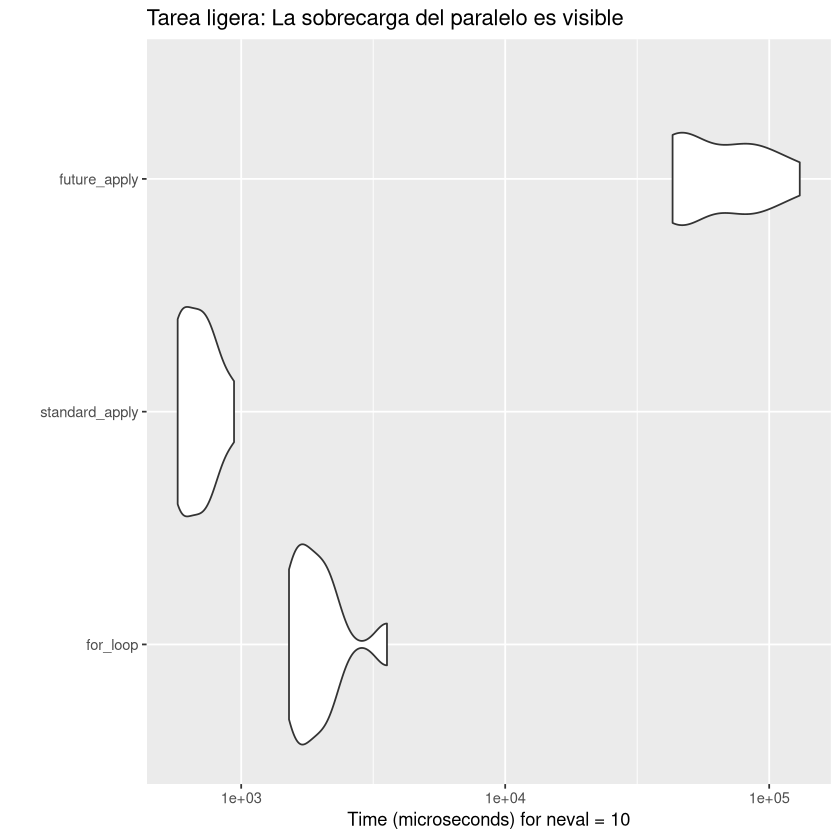
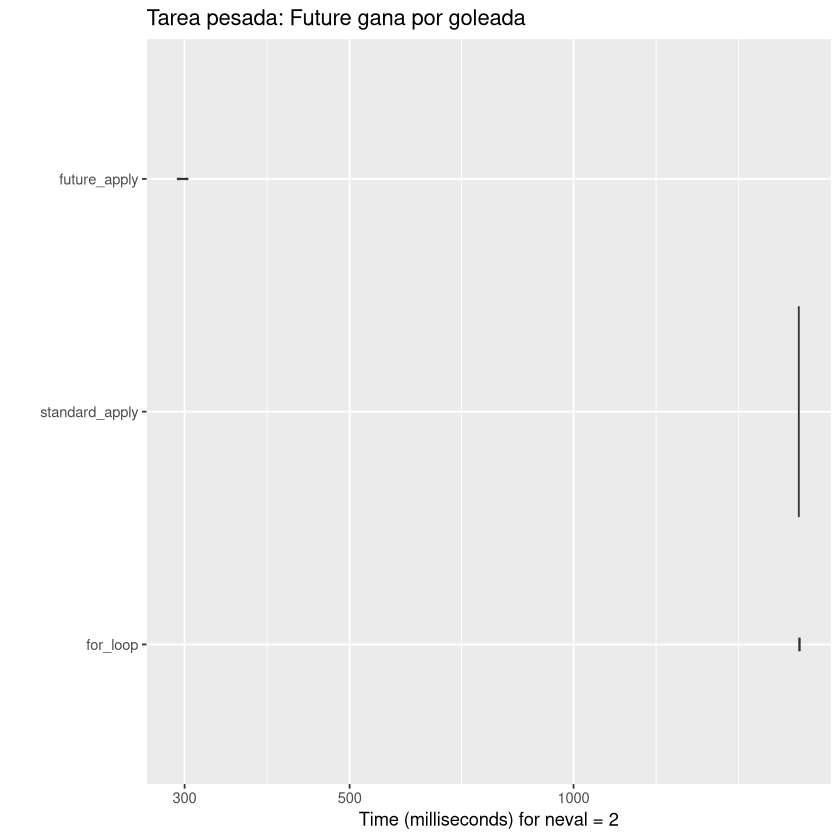

## Los tres contendientes

1.  **Bucle `for` estándar**: Iteración manual (con pre-asignación).
2.  **`lapply`**: El estándar funcional y secuencial de R.
3.  **`future_lapply`**: La versión paralelizada.

------------------------------------------------------------------------

## Experimento 1: La tarea "barata" (ligera)

En este escenario, hacemos algo muy rápido: calcular la media de 1.000 números.

``` r
n <- 200
data_list <- replicate(n, rnorm(1000), simplify = FALSE)

bench_cheap <- microbenchmark(
  for_loop = {
    res_for <- vector("list", n)
    for (i in 1:n) res_for[[i]] <- mean(data_list[[i]])
  },
  standard_apply = lapply(data_list, mean),
  future_apply = future_lapply(data_list, mean),
  times = 10
)

# Generar tabla
kable(summary(bench_cheap), caption = "Resultados de la tarea ligera (milisegundos)")

# Generar figura
autoplot(bench_cheap) +
  labs(title = "Tarea ligera: La sobrecarga del paralelo es visible")
```


    Table: Resultados de la tarea ligera (milisegundos)

    |expr           |       min|        lq|       mean|    median|        uq|        max| neval|
    |:--------------|---------:|---------:|----------:|---------:|---------:|----------:|-----:|
    |for_loop       |  1517.486|  1635.074|  2010.5220|  1846.978|  2086.406|   3566.354|    10|
    |standard_apply |   574.656|   579.240|   695.3018|   690.241|   777.345|    939.550|    10|
    |future_apply   | 43056.405| 44634.294| 69688.5494| 61279.304| 84963.011| 130556.395|    10|



------------------------------------------------------------------------

## Experimento 2: La tarea "cara" (pesada)

En este escenario, simulamos un trabajo "pesado" añadiendo un pequeño retardo (`Sys.sleep`). Esto imita el modelado estadístico complejo o el web scraping.

``` r
n_heavy <- 20
data_heavy <- replicate(n_heavy, rnorm(10), simplify = FALSE)

# Una función que tarda 0,1 segundos por llamada
heavy_func <- function(x) {
  Sys.sleep(0.1)
  mean(x)
}

bench_expensive <- microbenchmark(
  for_loop = {
    res_for <- vector("list", n_heavy)
    for (i in 1:n_heavy) res_for[[i]] <- heavy_func(data_heavy[[i]])
  },
  standard_apply = lapply(data_heavy, heavy_func),
  future_apply = future_lapply(data_heavy, heavy_func),
  times = 2 # ¡Pocas iteraciones porque es lento!
)

# Generar tabla
kable(summary(bench_expensive), caption = "Resultados de la tarea pesada (segundos)")

# Generar figura
autoplot(bench_expensive) +
  labs(title = "Tarea pesada: Future gana por goleada")
```


    Table: Resultados de la tarea pesada (segundos)

    |expr           |       min|        lq|      mean|    median|        uq|       max| neval|
    |:--------------|---------:|---------:|---------:|---------:|---------:|---------:|-----:|
    |for_loop       | 2010.5608| 2010.5608| 2012.4051| 2012.4051| 2014.2494| 2014.2494|     2|
    |standard_apply | 2008.1570| 2008.1570| 2008.2640| 2008.2640| 2008.3710| 2008.3710|     2|
    |future_apply   |  293.6279|  293.6279|  298.1794|  298.1794|  302.7309|  302.7309|     2|


