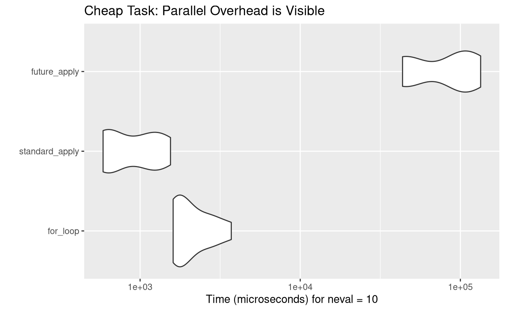
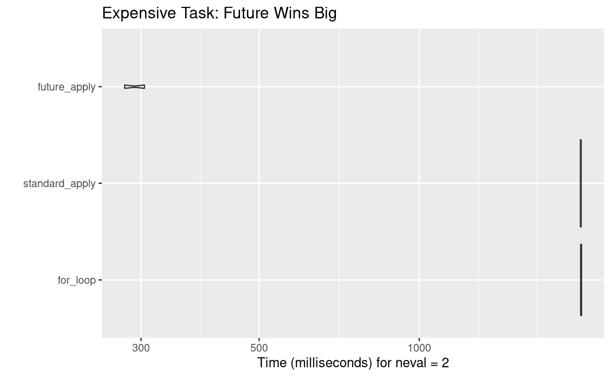

## The Three Contenders

1.  **Standard `for` loop**: Manual iteration (pre-allocated).
2.  **`lapply`**: The functional, sequential R standard.
3.  **`future_lapply`**: The parallelized version.

------------------------------------------------------------------------

## Experiment 1: The "Cheap" Task

In this scenario, we do something very fast: calculating the mean of 1,000 numbers.

<pre class='chroma'><code class='language-r' data-lang='r'>n &lt;- 200
data_list &lt;- <a href='https://rdrr.io/r/base/lapply.html'>replicate</a>(n, <a href='https://rdrr.io/r/stats/Normal.html'>rnorm</a>(1000), simplify = FALSE)

bench_cheap &lt;- <a href='https://rdrr.io/pkg/microbenchmark/man/microbenchmark.html'>microbenchmark</a>(
  for_loop = &#123;
    res_for &lt;- <a href='https://rdrr.io/r/base/vector.html'>vector</a>("list", n)
    for(i in 1:n) res_for[[i]] &lt;- <a href='https://rdrr.io/r/base/mean.html'>mean</a>(data_list[[i]])
  &#125;,
  standard_apply = <a href='https://rdrr.io/r/base/lapply.html'>lapply</a>(data_list, mean),
  future_apply   = <a href='https://future.apply.futureverse.org/reference/future_lapply.html'>future_lapply</a>(data_list, mean),
  times = 10
)

# Generate Table
<a href='https://rdrr.io/pkg/knitr/man/kable.html'>kable</a>(<a href='https://rdrr.io/r/base/summary.html'>summary</a>(bench_cheap), caption = "Cheap Task Results (milliseconds)")
</code></pre>

| expr           |       min |        lq |       mean |    median |         uq |        max | neval |
|:------------|--------:|--------:|---------:|--------:|---------:|---------:|-----:|
| for_loop       |  1608.359 |  1670.975 |  2190.1166 |  1903.875 |   2669.886 |   3709.897 |    10 |
| standard_apply |   587.176 |   595.874 |   947.8083 |   867.347 |   1267.916 |   1548.279 |    10 |
| future_apply   | 43543.992 | 46387.785 | 84049.1765 | 99176.992 | 102294.771 | 133827.555 |    10 |

Cheap Task Results (milliseconds)

<pre class='chroma'><code class='language-r' data-lang='r'>
# Generate Figure
<a href='https://ggplot2.tidyverse.org/reference/autoplot.html'>autoplot</a>(bench_cheap) + <a href='https://ggplot2.tidyverse.org/reference/labs.html'>labs</a>(title = "Cheap Task: Parallel Overhead is Visible")
#&gt; Warning: `aes_string()` was deprecated in ggplot2 3.0.0.
#&gt; ℹ Please use tidy evaluation idioms with `aes()`.
#&gt; ℹ See also `vignette("ggplot2-in-packages")` for more information.
#&gt; ℹ The deprecated feature was likely used in the microbenchmark package.
#&gt;   Please report the issue at
#&gt;   &lt;https://github.com/joshuaulrich/microbenchmark/issues/&gt;.
#&gt; This warning is displayed once per session.
#&gt; Call `lifecycle::last_lifecycle_warnings()` to see where this warning was
#&gt; generated.
</code></pre>

------------------------------------------------------------------------

## Experiment 2: The "Expensive" Task

In this scenario, we simulate "heavy" work by adding a tiny delay (`Sys.sleep`). This mimics complex statistical modeling or web scraping.

<pre class='chroma'><code class='language-r' data-lang='r'>n_heavy &lt;- 20
data_heavy &lt;- <a href='https://rdrr.io/r/base/lapply.html'>replicate</a>(n_heavy, <a href='https://rdrr.io/r/stats/Normal.html'>rnorm</a>(10), simplify = FALSE)

# A function that takes 0.1 seconds per call
heavy_func &lt;- function(x) &#123;
  <a href='https://rdrr.io/r/base/Sys.sleep.html'>Sys.sleep</a>(0.1)
  <a href='https://rdrr.io/r/base/mean.html'>mean</a>(x)
&#125;

bench_expensive &lt;- <a href='https://rdrr.io/pkg/microbenchmark/man/microbenchmark.html'>microbenchmark</a>(
  for_loop = &#123;
    res_for &lt;- <a href='https://rdrr.io/r/base/vector.html'>vector</a>("list", n_heavy)
    for(i in 1:n_heavy) res_for[[i]] &lt;- heavy_func(data_heavy[[i]])
  &#125;,
  standard_apply = <a href='https://rdrr.io/r/base/lapply.html'>lapply</a>(data_heavy, heavy_func),
  future_apply   = <a href='https://future.apply.futureverse.org/reference/future_lapply.html'>future_lapply</a>(data_heavy, heavy_func),
  times = 2 # Low iterations because it's slow!
)

# Generate Table
<a href='https://rdrr.io/pkg/knitr/man/kable.html'>kable</a>(<a href='https://rdrr.io/r/base/summary.html'>summary</a>(bench_expensive), caption = "Expensive Task Results (seconds)")
</code></pre>

| expr           |       min |        lq |      mean |    median |        uq |       max | neval |
|:------------|--------:|--------:|--------:|--------:|--------:|--------:|-----:|
| for_loop       | 2010.7866 | 2010.7866 | 2014.4950 | 2014.4950 | 2018.2033 | 2018.2033 |     2 |
| standard_apply | 2008.7650 | 2008.7650 | 2011.7931 | 2011.7931 | 2014.8213 | 2014.8213 |     2 |
| future_apply   |  279.5349 |  279.5349 |  292.0067 |  292.0067 |  304.4786 |  304.4786 |     2 |

Expensive Task Results (seconds)

<pre class='chroma'><code class='language-r' data-lang='r'>
# Generate Figure
<a href='https://ggplot2.tidyverse.org/reference/autoplot.html'>autoplot</a>(bench_expensive) + <a href='https://ggplot2.tidyverse.org/reference/labs.html'>labs</a>(title = "Expensive Task: Future Wins Big")
</code></pre>

