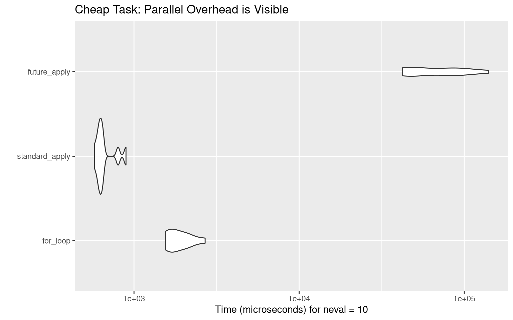
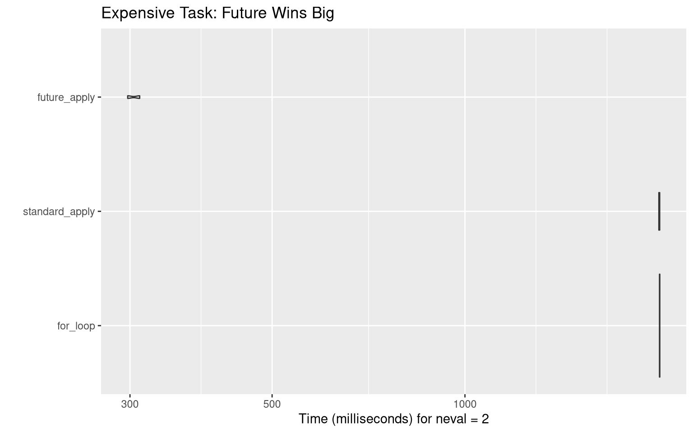

## The Three Contenders

1.  **Standard `for` loop**: Manual iteration (pre-allocated).
2.  **`lapply`**: The functional, sequential R standard.
3.  **`future_lapply`**: The parallelized version.

------------------------------------------------------------------------

## Experiment 1: The "Cheap" Task

In this scenario, we do something very fast: calculating the mean of 1,000 numbers.

``` r
n <- 200
data_list <- replicate(n, rnorm(1000), simplify = FALSE)

bench_cheap <- microbenchmark(
  for_loop = {
    res_for <- vector("list", n)
    for (i in 1:n) res_for[[i]] <- mean(data_list[[i]])
  },
  standard_apply = lapply(data_list, mean),
  future_apply = future_lapply(data_list, mean),
  times = 10
)

# Generate Table
kable(summary(bench_cheap), caption = "Cheap Task Results (milliseconds)")
```

| expr | min | lq | mean | median | uq | max | neval |
|:------------|--------:|--------:|---------:|---------:|--------:|---------:|-----:|
| for_loop | 1551.019 | 1644.471 | 1903.9925 | 1804.7350 | 2142.084 | 2695.779 | 10 |
| standard_apply | 576.841 | 610.671 | 665.6729 | 630.1005 | 649.784 | 894.412 | 10 |
| future_apply | 42336.477 | 45494.637 | 72417.1849 | 64824.6360 | 91603.538 | 139996.941 | 10 |

Cheap Task Results (milliseconds)

``` r
# Generate Figure
autoplot(bench_cheap) +
  labs(title = "Cheap Task: Parallel Overhead is Visible")
```



------------------------------------------------------------------------

## Experiment 2: The "Expensive" Task

In this scenario, we simulate "heavy" work by adding a tiny delay (`Sys.sleep`). This mimics complex statistical modeling or web scraping.

``` r
n_heavy <- 20
data_heavy <- replicate(n_heavy, rnorm(10), simplify = FALSE)

# A function that takes 0.1 seconds per call

heavy_func <- function(x) {
  Sys.sleep(0.1)
  mean(x)
}

bench_expensive <- microbenchmark(
  for_loop = {
    res_for <- vector("list", n_heavy)
    for (i in 1:n_heavy) res_for[[i]] <- heavy_func(data_heavy[[i]])
  },
  standard_apply = lapply(data_heavy, heavy_func),
  future_apply = future_lapply(data_heavy, heavy_func),
  times = 2 # Low iterations because it's slow!
)

# Generate Table

kable(summary(bench_expensive), caption = "Expensive Task Results (seconds)")
```

| expr | min | lq | mean | median | uq | max | neval |
|:------------|--------:|--------:|--------:|--------:|--------:|--------:|-----:|
| for_loop | 2012.2580 | 2012.2580 | 2013.3410 | 2013.3410 | 2014.4241 | 2014.4241 | 2 |
| standard_apply | 2007.6682 | 2007.6682 | 2010.6357 | 2010.6357 | 2013.6033 | 2013.6033 | 2 |
| future_apply | 297.5463 | 297.5463 | 304.1004 | 304.1004 | 310.6545 | 310.6545 | 2 |

Expensive Task Results (seconds)

``` r
# Generate Figure

autoplot(bench_expensive) +
  labs(title = "Expensive Task: Future Wins Big")
```


