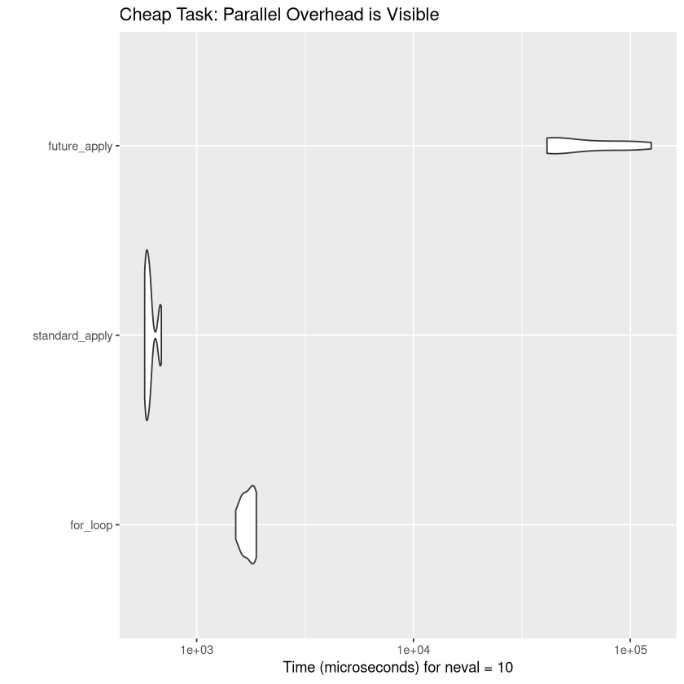
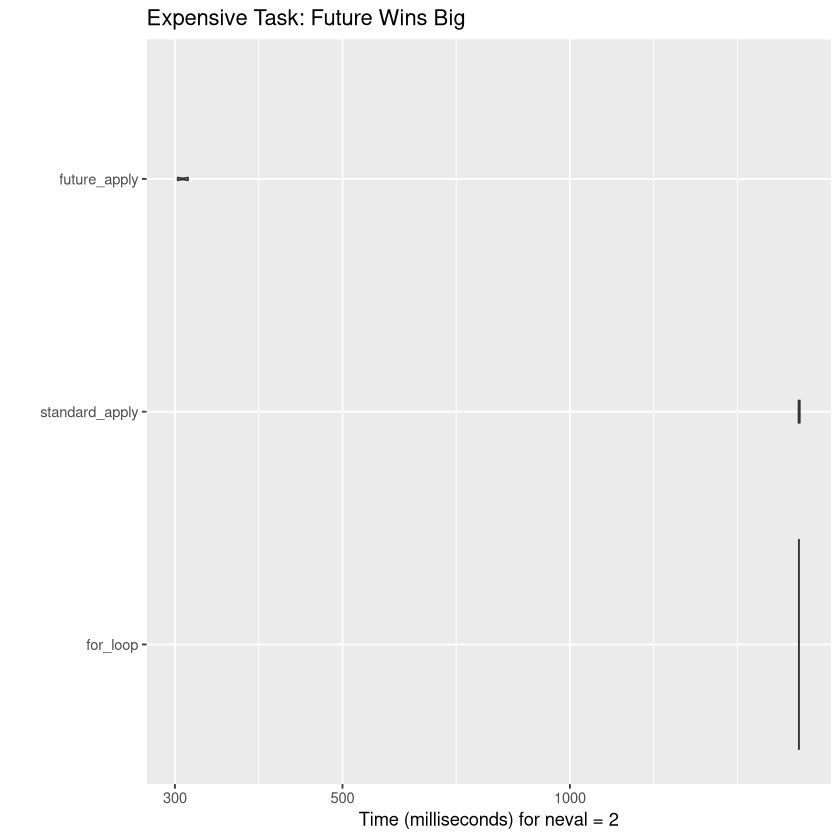

## The Three Contenders

1.  **Standard `for` loop**: Manual iteration (pre-allocated).
2.  **`lapply`**: The functional, sequential R standard.
3.  **`future_lapply`**: The parallelized version.

------------------------------------------------------------------------

## Experiment 1: The "Cheap" Task

In this scenario, we do something very fast: calculating the mean of 1,000 numbers.

``` r
n <- 200
data_list <- replicate(n, rnorm(1000), simplify = FALSE)

bench_cheap <- microbenchmark(
  for_loop = {
    res_for <- vector("list", n)
    for (i in 1:n) res_for[[i]] <- mean(data_list[[i]])
  },
  standard_apply = lapply(data_list, mean),
  future_apply = future_lapply(data_list, mean),
  times = 10
)

# Generate Table
kable(summary(bench_cheap), caption = "Cheap Task Results (milliseconds)")

# Generate Figure
autoplot(bench_cheap) +
  labs(title = "Cheap Task: Parallel Overhead is Visible")
```


    Table: Cheap Task Results (milliseconds)

    |expr           |       min|        lq|       mean|     median|        uq|        max| neval|
    |:--------------|---------:|---------:|----------:|----------:|---------:|----------:|-----:|
    |for_loop       |  1513.654|  1633.213|  1730.0914|  1749.5575|  1863.904|   1882.998|    10|
    |standard_apply |   575.424|   582.899|   610.7246|   599.2365|   615.042|    686.890|    10|
    |future_apply   | 41263.220| 42569.222| 66170.0383| 53849.4030| 94305.523| 124813.811|    10|



------------------------------------------------------------------------

## Experiment 2: The "Expensive" Task

In this scenario, we simulate "heavy" work by adding a tiny delay (`Sys.sleep`). This mimics complex statistical modeling or web scraping.

``` r
n_heavy <- 20
data_heavy <- replicate(n_heavy, rnorm(10), simplify = FALSE)

# A function that takes 0.1 seconds per call

heavy_func <- function(x) {
  Sys.sleep(0.1)
  mean(x)
}

bench_expensive <- microbenchmark(
  for_loop = {
    res_for <- vector("list", n_heavy)
    for (i in 1:n_heavy) res_for[[i]] <- heavy_func(data_heavy[[i]])
  },
  standard_apply = lapply(data_heavy, heavy_func),
  future_apply = future_lapply(data_heavy, heavy_func),
  times = 2 # Low iterations because it's slow!
)

# Generate Table

kable(summary(bench_expensive), caption = "Expensive Task Results (seconds)")

# Generate Figure

autoplot(bench_expensive) +
  labs(title = "Expensive Task: Future Wins Big")
```


    Table: Expensive Task Results (seconds)

    |expr           |      min|       lq|      mean|    median|        uq|       max| neval|
    |:--------------|--------:|--------:|---------:|---------:|---------:|---------:|-----:|
    |for_loop       | 2009.630| 2009.630| 2010.0217| 2010.0217| 2010.4130| 2010.4130|     2|
    |standard_apply | 2007.846| 2007.846| 2011.5187| 2011.5187| 2015.1915| 2015.1915|     2|
    |future_apply   |  302.531|  302.531|  307.3779|  307.3779|  312.2248|  312.2248|     2|


