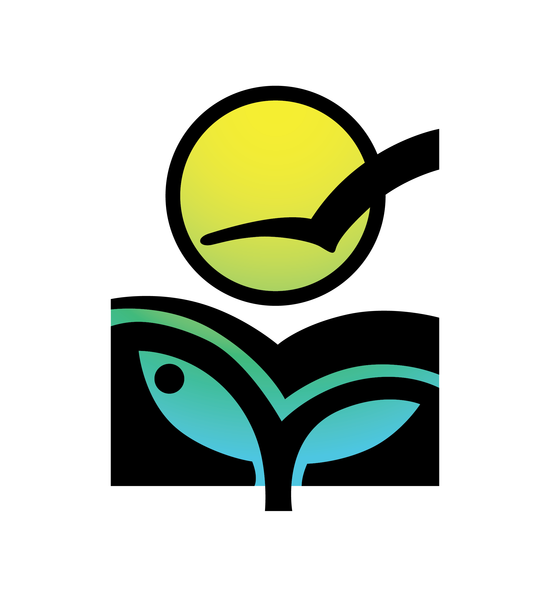
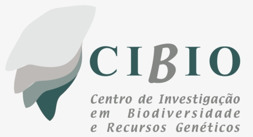
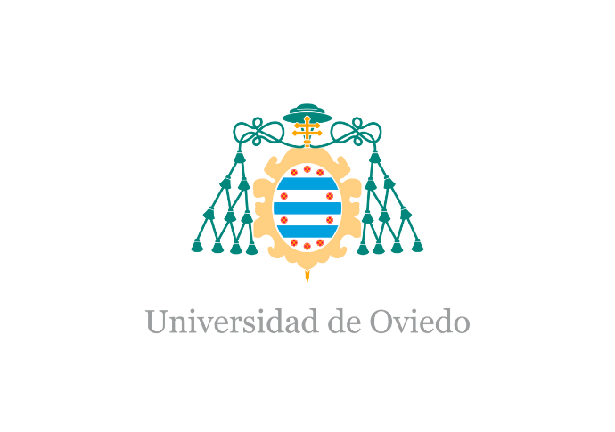
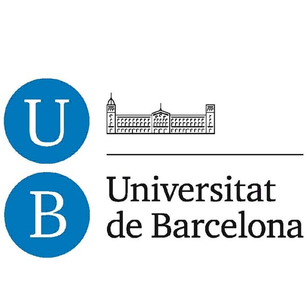

## Experience

    <table class="academic-cv-table">
        <thead>
            <tr>
                <th class="col-exp-logo">Logo</th>
                <th class="col-exp-inst">Institution</th>
                <th class="col-exp-pos">Position</th>
                <th class="col-exp-date">Dates</th>
                <th class="col-exp-loc">Location</th>
            </tr>
        </thead>
        <tbody>
            <tr>
                <td rowspan="2"></td>
                <td rowspan="2"><strong><a href="https://www.ivb.cz/en/" target="_blank">Institute of Vertebrate Biology, Czech Academy of Sciences</a></strong></td>
                <td>Post-Doctoral Researcher</td>
                <td>2024-Pres.</td>
                <td rowspan="2">Studenec, CZ</td>
            </tr>
            <tr>
                <td>Post-Doctoral Researcher</td>
                <td>2020-2024</td>
            </tr>
            <tr>
                <td rowspan="1"></td>
                <td rowspan="1"><strong><a href="https://www.cibio.up.pt/en/" target="_blank">CIBIO</a></strong></td>
                <td>Post-Doctoral Researcher</td>
                <td>2018-2020</td>
                <td rowspan="2">Vairaõ, PT</td>
            </tr>
        </tbody>
    </table>

## Education

    <table class="academic-cv-table">
        <thead>
            <tr>
                <th class="col-edu-logo">Logo</th>
                <th class="col-edu-inst">Institution</th>
                <th class="col-edu-deg">Degree</th>
                <th class="col-edu-year">Year</th>
                <th class="col-edu-loc">Location</th>
            </tr>
        </thead>
        <tbody>
            <tr>
                <td rowspan="1"></td>
                <td rowspan="1"><strong><a href="https://biologia.uniovi.es/" target="_blank">Universidad de Oviedo</a></strong></td>
                <td>PhD in BioGeoSciences</td>
                <td>2014-2018</td>
                <td>Oviedo, ES</td>
            </tr>
            <tr>
                <td rowspan="1"></td>
                <td rowspan="1"><strong><a href="https://www.ub.edu/portal/web/biologia/" target="_blank">Universitat de Barcelona</a></strong></td>
                <td>MSc in Biodiversity</td>
                <td>2010-2011</td>
                <td>Barcelona, ES</td>
            </tr>
            <tr>
                <td rowspan="1"></td>
                <td rowspan="1"><strong><a href="https://www.ehu.eus/eu/web/zientzia-teknologia-fakultatea" target="_blank">UPV / EHU</a></strong></td>
                <td>Licenciatura (degree) in Biology</td>
                <td>2005-2010</td>
                <td>Bilbao, ES</td>
            </tr>
        </tbody>
    </table>

